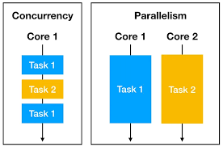
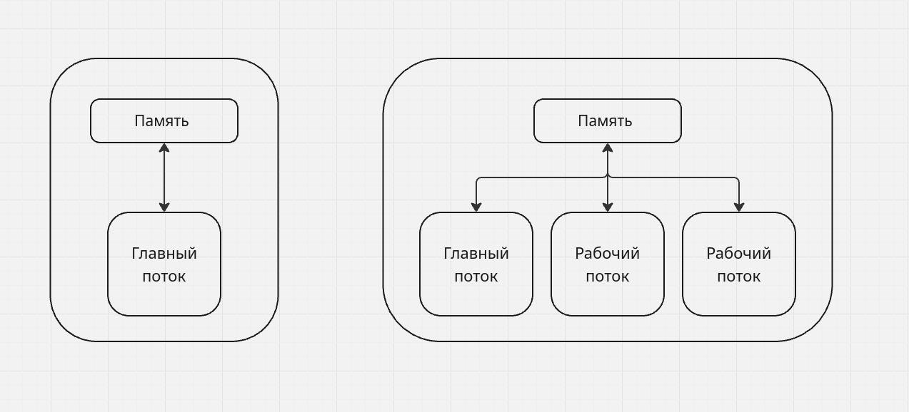
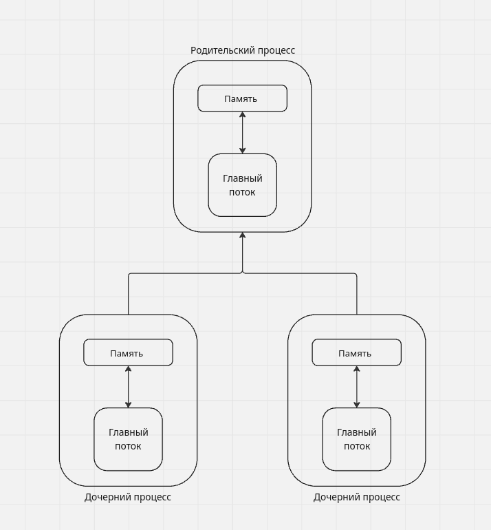
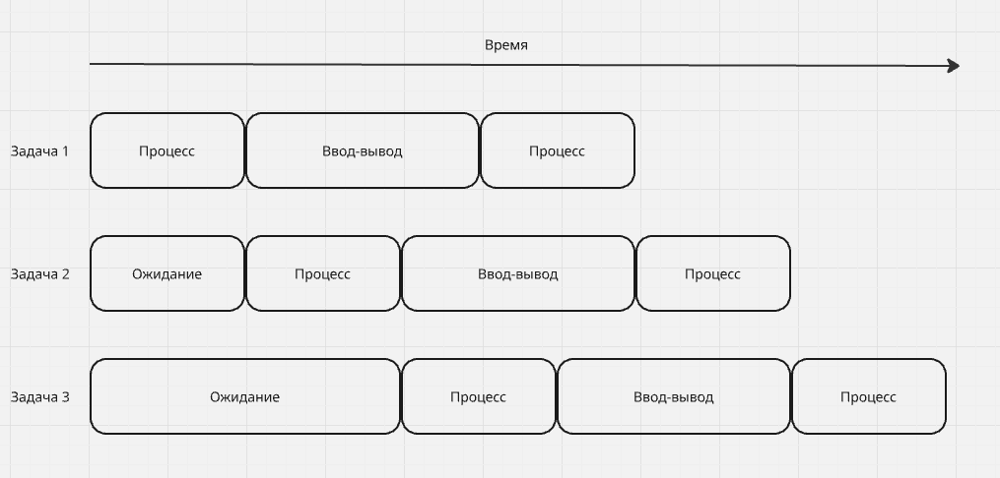

# Первое знакомство с Asyncio

### Зачем нам Asyncio?

При синхронной обработке мы ждем приложение, пока она обработает логику кода по очередности. Но мы можем оптимизорвать 
процесс за счет конкурентности в коде. В целом это концепция есть во многих языках, и они похожи между собой (**нп. в 
С и JavaScript**) где мы ставим элементы **async/await**. Поэтому используя **asyncio** мы можем достичь конкурентности и 
асинхронки в нашем коде.

### Что такое ограниченность производительностью ввода-вывода и ограниченность быстродействием процесса

Операции, ограниченные производительностью ввода-вывода и быстродействием процессора, обычно сосуществуют бок о бок. 
Посмотрите пример 
[example-1.py](https://github.com/Pro100-Almaz/Python-Concurrency-with-asyncio/blob/108b3e5bb7d16bfac9f8b17baa57ca7a31d5bddc/chapter_1/example-1.py), 
тут можно разделить логику кода на 2 группы и понять, какие работают быстро без ожиданий и те, которые ждут I/O процесс.

### Конкурентность, параллелизм и многозадачность

1. **Конкурентность**. К примеру, у нас есть пекарь, выпекающий два разных торта. Чтобы их испечь, нужно сначала разогреть 
духовку. Разогрев может занимать десятки минут, и пока духовка разогревается, нам не обязательно его ждать, и мы можем делать
пока другие этапы. И это и есть **Конкурентность** когда в процессе работы мы можем переключиться между задачами при ожидание 
результата процесса, не зависящее от нас.
2. **Параллелизм**. Тот же пример с пекарем, но у нас их будет 2 (или больше) и процессы будут работать параллельно не 
завися друг от друга.

* Разница между конкурентностью и параллелизмом в том, что первый может работать на одном ядре процессора и применив 
многозадачность, переключатся между задачами. А для второго, нам нужна 2 ядра (или больше в зависимости от процессов), 
чтобы они были не зависимы друг от друга.

3. **Многозадачность**. Это когда во время одной задачи мы можем делать вторую, например, когда нас везет автобус на 
работу, читаем книгу. Есть 2 типа многозадачности:
   1. Вытесняющая — ОС переключает задачи с помощью квантования времени.
   2. Кооперативная — вместо того чтобы полагаться на системы мы явно определяем в коде, где можно уступить управление. 
   Также мы определяем **гранулярность** для системы, чтобы давать инструкцию для переключения. Также потребляет меньше 
   ресурсов. 

### Процессы, потоки, многопоточность и многопроцессность 

1. **Процесс** называется работающее приложение, которому выделена область памяти, недоступная другим приложениям.
2. **Поток** можно представлять себе как облегченные процессы. Кроме того, это наименьшая единица выполнения, которая может
управлять операционной системой.

Для примера понимания посмотрите код [example-2.py](https://github.com/Pro100-Almaz/Python-Concurrency-with-asyncio/blob/11453417cf4f4a6eeae322d68a8aecdba28c4ced/chapter_1/example-2.py).

Также можно сделать несколько процессов [example-3.py](https://github.com/Pro100-Almaz/Python-Concurrency-with-asyncio/blob/11453417cf4f4a6eeae322d68a8aecdba28c4ced/chapter_1/example-3.py).

### Глобальный блокировки интерпретатора

**GIL** (Global Interpreter Lock) не дает Python процессу исполнять более одной команды байт-кода
в каждый момент времени. Это означает, что, даже если имеется несколько потоков на многоядерной машине, 
интерпретатор сможет в каждый момент исполнять только один поток, содержащий написанный на Python код.

Зачем нам нужен GIL? В CPython у нас имеется **подсчет ссылок** на объекты, которые создаются и удаляются 
в процессе программы. Но проблема в том, что у нас CPython не является **потокобезопасным** и поэтому при конкурентом
использований одного обьекта могут привести к **состоянию гонки**. 

Тут пример того, что хоть мы и написали функцию Фибоначчи через threading и через обычный поток, 
у нас время отработки будет одинаковым из-за GIL. 

Пример кода [example-4.py](https://github.com/Pro100-Almaz/Python-Concurrency-with-asyncio/blob/2ff32daadc6f3b7a6400329455641a2a17b2abcf/chapter_1/example-4.py).

### Освобождается ли когда-нибудь GIL?

GIL освобождается на время выполнения операций **ввода-вывода**. При работе с asyncio 
мы создаем объекты _сопрограмм_. Сопрограмму мы можем представить как облегченный
поток программы. И в чем заключается плюс? В том что ожидая завершения сопрограмм, 
занимающихся вводом-выводом, мы можем выполнять другой Python-код, получая таким 
образом конкурентность. 

### Как работает цикл событий

По сути своей **цикл событий** очень прост. Мы создаем очередь, в которой хранится 
список событий или сообщений, а затем входим в бесконечный цикл, где обрабатывается 
сообщение по мере их поступления. 

На рисунке показан поток выполннения, соответсвующий логике цикла событий в Python.
Глядя на диаграмму слева направо, мы видим, что в каждой момент времени работает только 
один счетный кусок кода, но при этом конкурентно выполняется одна или две операций ввода-вывода. 

