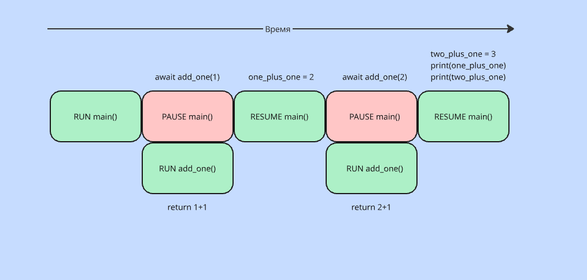

# Основы asyncio

**Сопрограмму** можно рассмотреть как обычную функцию Python, наделенную сверхспособностью:
приостанавливать, встретив операцию, для выполнения которой нужно заметное время.

В Python, слово _async_ определяет сопрограмму, а слово _await_ приостанавливает 
ее на время выполнения длительной операций. 

По базовой логике, если запускать код, то сопрограмма не будет работать, как должна работать 
асинхронная программа (через принт можно увидеть тип обьекта). Потому что, для запуска сопрограммы нам нужна специальная 
точка входа, которая предоставляется asyncio, а именно метод _run()_. По логике можно запустить на прямую через точку 
входа, передавая сопрограмму в **run**, или можно обернуть _main()_ файл для начальной точки запуская цепочку
кода и ожидая сопрограмму через **await**. Для примера можно посмотреть этот код:

[example-1.py](https://github.com/Pro100-Almaz/Python-Concurrency-with-asyncio/blob/87b3485e65f6e9123372e392beca9b2574d613a8/chapter_2/example-1.py)

Визуальная иллюстрация:

